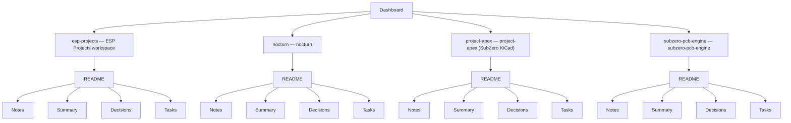

# Cluster tree

This note is a **real tree** (top-down diagram). The **Graph** view cannot do this for the whole vault — it uses physics, not hierarchy.

Regenerate after adding a project:

```bash
python3 scripts/refresh_cluster_tree.py
```

## Tree diagram



## Quick links (Obsidian)

- [[Dashboard]]
- [[Projects/esp-projects/README|esp-projects]]
- [[Projects/nocturn/README|nocturn]]
- [[Projects/project-apex/README|project-apex]]
- [[Projects/subzero-pcb-engine/README|subzero-pcb-engine]]

## Make the Graph less messy

- In **Graph** → filters: **hide tags** (green nodes connect many notes).
- Use **Local graph** from **Dashboard** with depth **2**.
- This **CLUSTER-TREE** note is for hierarchy; Graph is for discovery.

