# Cluster tree

Hierarchie **oben → unten** (Projektordner). **Graph-Ansicht** bleibt physikalisch (Keulen) — Farb-Cluster kommen aus **Einstellungen → Graph view → Gruppen** (`cluster-registry.json` + `.obsidian/graph.json`).

**Weniger unnötige Kanten:** möglichst **keine** `[[Wiki-Links]]` zwischen beliebigen Notizen; Themen atomic unter `Topics/<cluster-slug>/` mit Tag `topic` / `cluster/...` — Verknüpfung über Ordner und Dataview oder einzelne Cluster-MOCs in `Clusters/`.

Nach neuem Projekt oder Registry-Änderung:

```bash
python3 scripts/refresh_cluster_tree.py
```

Details: [[Vault-Leitfaden]].

## Tree diagram

```mermaid
flowchart TB
  classDef hardware_style fill:#E3F2FD,stroke:#1565C0,stroke-width:2px,color:#0D47A1
  classDef software_style fill:#F3E5F5,stroke:#6A1B9A,stroke-width:2px,color:#4A148C
  classDef meta_style fill:#FFF3E0,stroke:#EF6C00,stroke-width:2px,color:#E65100
  classDef uncategorized_style fill:#ECEFF1,stroke:#78909C,stroke-width:2px,color:#37474F
  D["Dashboard"]
  subgraph hardware_cluster ["🔧 Hardware & PCB"]
    atopile_parts_root["atopile-parts — atopile-parts Library (reusable atomic components)"]
    atopile_parts_root --> atopile_parts_readme[README]
    atopile_parts_readme --> atopile_parts_notes[Notes]
    atopile_parts_notes --> atopile_parts_summary[Summary]
    atopile_parts_summary --> atopile_parts_decisions[Decisions]
    atopile_parts_decisions --> atopile_parts_tasks[Tasks]
    lipo_devboard_root["lipo-devboard — ESP32 LiPo Devboard (atopile trial)"]
    lipo_devboard_root --> lipo_devboard_readme[README]
    lipo_devboard_readme --> lipo_devboard_notes[Notes]
    lipo_devboard_notes --> lipo_devboard_summary[Summary]
    lipo_devboard_summary --> lipo_devboard_decisions[Decisions]
    lipo_devboard_decisions --> lipo_devboard_tasks[Tasks]
    project_apex_root["project-apex — project-apex (SubZero KiCad)"]
    project_apex_root --> project_apex_readme[README]
    project_apex_readme --> project_apex_notes[Notes]
    project_apex_notes --> project_apex_summary[Summary]
    project_apex_summary --> project_apex_decisions[Decisions]
    project_apex_decisions --> project_apex_tasks[Tasks]
    subzero_next_root["subzero-next — subzero-next (greenfield KiCad)"]
    subzero_next_root --> subzero_next_readme[README]
    subzero_next_readme --> subzero_next_notes[Notes]
    subzero_next_notes --> subzero_next_summary[Summary]
    subzero_next_summary --> subzero_next_decisions[Decisions]
    subzero_next_decisions --> subzero_next_tasks[Tasks]
    subzero_pcb_engine_root["subzero-pcb-engine — subzero-pcb-engine"]
    subzero_pcb_engine_root --> subzero_pcb_engine_readme[README]
    subzero_pcb_engine_readme --> subzero_pcb_engine_notes[Notes]
    subzero_pcb_engine_notes --> subzero_pcb_engine_summary[Summary]
    subzero_pcb_engine_summary --> subzero_pcb_engine_decisions[Decisions]
    subzero_pcb_engine_decisions --> subzero_pcb_engine_tasks[Tasks]
  end
  subgraph software_cluster ["🌐 Web & Commerce"]
    neutral_shopify_shell_root["neutral-shopify-shell — Neutral Shopify shell"]
    neutral_shopify_shell_root --> neutral_shopify_shell_readme[README]
    neutral_shopify_shell_readme --> neutral_shopify_shell_notes[Notes]
    neutral_shopify_shell_notes --> neutral_shopify_shell_summary[Summary]
    neutral_shopify_shell_summary --> neutral_shopify_shell_decisions[Decisions]
    neutral_shopify_shell_decisions --> neutral_shopify_shell_tasks[Tasks]
    subzero_website_root["subzero-website — subzero-website (Sanctum Shopify storefront)"]
    subzero_website_root --> subzero_website_readme[README]
    subzero_website_readme --> subzero_website_notes[Notes]
    subzero_website_notes --> subzero_website_summary[Summary]
    subzero_website_summary --> subzero_website_decisions[Decisions]
    subzero_website_decisions --> subzero_website_tasks[Tasks]
  end
  subgraph meta_cluster ["📚 Meta & Story"]
    esp_projects_root["esp-projects — ESP Projects workspace"]
    esp_projects_root --> esp_projects_readme[README]
    esp_projects_readme --> esp_projects_notes[Notes]
    esp_projects_notes --> esp_projects_summary[Summary]
    esp_projects_summary --> esp_projects_decisions[Decisions]
    esp_projects_decisions --> esp_projects_tasks[Tasks]
    nocturn_root["nocturn — nocturn"]
    nocturn_root --> nocturn_readme[README]
    nocturn_readme --> nocturn_notes[Notes]
    nocturn_notes --> nocturn_summary[Summary]
    nocturn_summary --> nocturn_decisions[Decisions]
    nocturn_decisions --> nocturn_tasks[Tasks]
  end
  D --> atopile_parts_root
  D --> lipo_devboard_root
  D --> project_apex_root
  D --> subzero_next_root
  D --> subzero_pcb_engine_root
  D --> neutral_shopify_shell_root
  D --> subzero_website_root
  D --> esp_projects_root
  D --> nocturn_root
  class atopile_parts_root,lipo_devboard_root,project_apex_root,subzero_next_root,subzero_pcb_engine_root hardware_style
  class neutral_shopify_shell_root,subzero_website_root software_style
  class esp_projects_root,nocturn_root meta_style
```



## Quick links (minimal)

- [[Dashboard]]
- [[Vault-Leitfaden]]
- [[Clusters/README|Clusters]]
- [[Topics/README|Topics (atomare Punkte)]]
- [[Projects/atopile-parts/README|atopile-parts]]
- [[Projects/esp-projects/README|esp-projects]]
- [[Projects/lipo-devboard/README|lipo-devboard]]
- [[Projects/neutral-shopify-shell/README|neutral-shopify-shell]]
- [[Projects/nocturn/README|nocturn]]
- [[Projects/project-apex/README|project-apex]]
- [[Projects/subzero-next/README|subzero-next]]
- [[Projects/subzero-pcb-engine/README|subzero-pcb-engine]]
- [[Projects/subzero-website/README|subzero-website]]

## Graph weniger unübersichtlich

- **Globale Graph-Ansicht:** Tags ausblenden (`showTags: false` ist voreingestellt), damit keine grünen Pseudo-Kanten zu Tag-Knoten entstehen.
- **Farben:** Projekt-Knoten nach Cluster (Pfad-Groups); `Topics/` und `Clusters/` eigene Farben.
- **Links sparsam:** neue Themen als **eigene Datei** unter `Topics/…`; nur wo nötig `[[wikilinks]]` oder Überschrift in einem Cluster-MOC.

